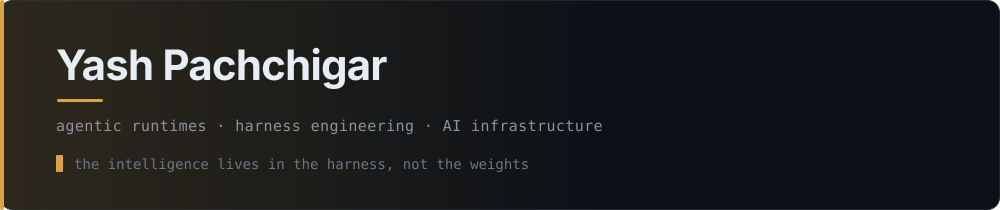

<picture>
  <source media="(prefers-color-scheme: dark)" srcset="assets/header-dark.svg">
  <source media="(prefers-color-scheme: light)" srcset="assets/header-light.svg">
  
</picture>

I build agentic runtimes and the unglamorous infrastructure that makes them reliable —
harnesses, tool protocols, and the plumbing between models and real systems.

AI Engineer at **Learning Enterprise, ASU**.

 

## I work agentically. Not as a demo — as the actual method.

Almost everything below was built by directing agents rather than typing the code
myself. That is a real engineering practice with its own tooling and its own
discipline, and it is the thing I have gotten genuinely good at.

**A fleet, not a chat window.** I run parallel agent sessions — one per project — on a
message bus so they can hand work to each other. An always-on agent lives on my own
server and is reachable from Slack, so work continues when I'm not at a terminal.

**Parallelism needs isolation.** `forge team` fans work out to multiple agents, each in
its own git worktree, and nothing merges until it is independently verified. Agents are
cheap and fast; the scarce resource is trust, so that's where the engineering goes.

**Authority is harness-owned, never model-owned.** The runtime decides what a model is
allowed to do — not the model, and not its output. A capable agent you cannot bound is
not a product.

**Verification is the whole job.** When generation is nearly free, review becomes the
bottleneck and the differentiator. My attention goes to the check, the benchmark, and
the release gate — not to the keystrokes.

 

## What I'm building

| | |
|:--|:--|
| **[forge](https://github.com/hackspaces/blueshark-forge)** | A model-agnostic agentic runtime for the terminal. A 1B local model and a frontier model run through the same loop — the harness is what makes either one capable. Python 3.10+, **stdlib-only, zero runtime dependencies**.   `pip install blueshark-forge` · [topk1.com/forge](https://topk1.com/forge/) |
| **[blueshark](https://github.com/hackspaces/blueshark)** | Reference architecture for a sovereign agentic coding model: fine-grained MoE with a shared expert, and Multi-head Latent Attention. |
| **[finstack-mcp](https://github.com/hackspaces/finstack-mcp)** | India-first MCP server for NSE/BSE market data, fundamentals, and daily research workflows. |
| **[mcp-suite](https://github.com/hackspaces/mcp-suite)** | Modular Model Context Protocol servers. Alongside it I maintain a family of read-only MCP connectors that put enterprise data sources behind one safe, auditable interface. |
| **macOS** | Small, sharp menu-bar tools in Swift — [PortWatch](https://github.com/hackspaces/PortWatch), [AppTrail](https://github.com/hackspaces/AppTrail), [DiskPulse](https://github.com/hackspaces/DiskPulse). |

 

## How I ship

**Dependencies are a promise you make to your users.** forge is stdlib-only on purpose.
Every dependency is one more thing a user has to trust, install, and live with.

**A merge is not the finish line.** A fixed bug sitting unreleased on `main` is worth
nothing. Branch → PR → merge on green → cut the release → then verify the *real* install
path in a clean environment. Green CI is not proof that anyone can install your software.

**Measure the change, not the intention.** A prompt change is a behavior change. If I
can't show the before and after on a benchmark, I haven't shown anything.

**Delete what doesn't earn its keep.** I have shipped features and then removed them
because they were impressive rather than useful. Subtraction is the harder edit.

**Cheapest thing that works.** Smallest instance, SQLite over a managed database, free
tier until a real workload says otherwise. Several production services run off one small
box, and that is the right call.

 

---

Python · TypeScript · Swift · Rust · [topk1.com](https://topk1.com)
